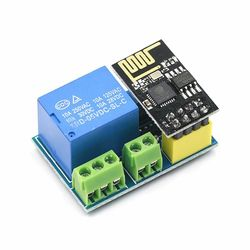

This sketch is intended for an ESP8266-01S in combination with a Relay v4.



It connects to an MQTT broker via TLS, using a private root CA certificate, a client certificate/key pair (which should accept the name used in the host entry below) and a user ID/password.
The certificates are stored in the SPIFFS space as `ca.crt`, `host.crt` and `host.key`. 
The other configuration data is stored in a Json string in the EEPROM space. Its format is as follows:

```
{
  "wifi": {
    "ssid": "my-ssid",
    "password": "my-password",
    "host": "my-client-name"
  },
  "time": {
    "tz": "UTC0",
    "1": "pool.ntp.org",
    "2": "time.nist.gov"
  }, 
  "mqtt": {
    "broker": "my-broker-name",
    "port": 1883,
    "user": "mqtt-user",
    "password": "mqtt-password"
  }
}
```
To save space (the EEPROM space is just 512 characters), whitespace can be removed if needed.

The `time` section can be omitted if the default values are OK (time zone UTC and the indicated time servers). Selective omission of time properties is fine as well. Also the `mqtt` `port` property can be omitted if `1883` is the correct value. The other properties are mandatory.

The EEPROM content is pseudo-encrypted so you can't immediately see the plain text passwords. However, the encryption isn't very strong - still looking how to improve that.

For MQTT we use the [homie](https://homieiot.github.io/) convention with device name the host entry in the configuration, node name `switch` and property `1` (since there is just one relay).

Send `true` to `homie/my-client-name/switch/1/set` to switch on the relay, and `false` to switch it off. The sketch will confirm the relay state in `homie/my-client-name/switch/1`
